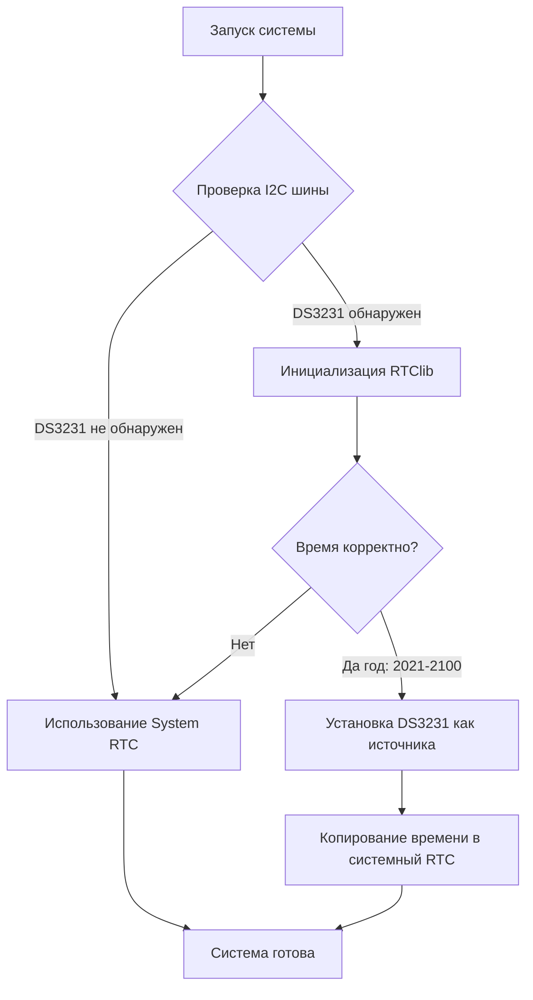

# Система времени Nixie Clock на ESP32

## Обзор архитектуры

Проект реализует гибридную систему времени с автоматическим переключением между источниками:
1. **DS3231** (внешние аппаратные часы) - приоритетный источник
2. **Внутренний RTC ESP32** - резервный источник

## 1. Первичная инициализация источников времени

### Логика инициализации при старте

**Алгоритм выбора источника:**



**Критерии выбора DS3231:**
- Устройство отвечает на I2C-адрес 0x68
- Успешная инициализация библиотекой RTClib
- Время в DS3231 корректно (год между 2021 и 2100)

**Ключевые особенности:**
- ✅ **Отложенная инициализация** - источники инициализируются при первом обращении
- ✅ **Автоматический выбор** - система сама определяет лучший источник
- ✅ **Синхронизация** - время DS3231 копируется в системное время ESP32

## 2. Процедура инициализации

### Последовательность выполнения

```cpp
// main.cpp
void setup() {
    initHardware();        // 1. Настройка пинов энкодера, кнопок
    initConfiguration();   // 2. Загрузка конфигурации из NVS
    initNTPClient();       // 3. Инициализация NTP клиента
    // 4. Инициализация времени произойдет автоматически
    //    при первом вызове getCurrentUTCTime()
}
```

### Функция checkTimeSource() (time_utils.cpp)

При **первом вызове** выполняет полную инициализацию:
1. Инициализация I2C шины (SDA=4, SCL=5)
2. Проверка наличия DS3231
3. Инициализация объекта RTC_DS3231
4. Проверка корректности времени
5. Настройка прерываний через `setupInterrupts()`

При **последующих вызовах**:
1. Быстрая проверка доступности DS3231
2. Переключение источника при необходимости

## 3. Логика работы с прерываниями

### Два режима работы

| Режим | Источник прерывания | Период | Инициализация |
|-------|---------------------|--------|---------------|
| **Режим 1** | DS3231 (SQW pin) | 1 Hz (аппаратный) | `attachInterrupt(SQW_PIN, FALLING)` |
| **Режим 2** | Внутренний таймер ESP32 | 1 Hz (программный) | `timerAlarmWrite(timer, 3000000, true)` |

### Алгоритм переключения

```cpp
// hardware.cpp
void setupInterrupts() {
    if (currentTimeSource == EXTERNAL_DS3231 && rtc) {
        // Режим 1: Прерывания от DS3231
        rtc->writeSqwPinMode(DS3231_SquareWave1Hz);
        attachInterrupt(digitalPinToInterrupt(SQW_PIN), 
                       onTimeInterrupt, FALLING);
    } else {
        // Режим 2: Программный таймер ESP32
        timer = timerBegin(0, TIMER_DIVIDER, true);
        timerAttachInterrupt(timer, onTimeInterrupt, true);
        timerAlarmWrite(timer, TIMER_INTERVAL, true);
        timerAlarmEnable(timer);
    }
}
```

### Обработчик прерывания

```cpp
void IRAM_ATTR onTimeInterrupt() {
    portENTER_CRITICAL_ISR(&timerMux);
    timeUpdated = true;  // Установка флага обновления
    digitalWrite(LED_PIN, HIGH);  // Индикация работы
    portEXIT_CRITICAL_ISR(&timerMux);
}
```

**Важно:** Флаг `timeUpdated` только сигнализирует об обновлении, но не запускает логику обработки времени.

## 4. Получение времени из источников

### Единая точка доступа

**Все компоненты системы используют одну функцию:**
```cpp
time_t getCurrentUTCTime() {
    checkTimeSource();  // Всегда проверяем актуальность источника
    
    if (currentTimeSource == EXTERNAL_DS3231 && rtc) {
        // Чтение из DS3231
        DateTime now = rtc->now();
        time_t rtc_time = convertDateTimeToTimeT(now);
        
        // Синхронизация системного времени
        struct timeval tv = { rtc_time, 0 };
        settimeofday(&tv, NULL);
        
        return rtc_time;
    } else {
        // Чтение системного времени
        time_t sys_time;
        time(&sys_time);
        return sys_time;
    }
}
```

### Динамическое переключение источников

```
[Источники времени]
    ├── DS3231 (приоритет 1) → При доступности
    └── System RTC (приоритет 2) → При недоступности или ошибке DS3231
         ↓
getCurrentUTCTime() → Единый интерфейс
         ↓
[Потребители]
    ├── printTime() - вывод в лог
    ├── checkAlarms() - проверка будильников  
    ├── syncTime() - NTP синхронизация
    └── Команды управления
```

### Особенности работы:

1. **При каждом обращении** к `getCurrentUTCTime()`:
   - Проверяется доступность DS3231
   - При необходимости переключается источник
   - Время DS3231 синхронизируется с системным

2. **При отключении DS3231 во время работы**:
   - Следующий вызов `getCurrentUTCTime()` обнаружит отсутствие
   - Автоматическое переключение на System RTC
   - Логирование события в Serial

3. **При восстановлении DS3231**:
   - Автоматическое переключение обратно на DS3231
   - Синхронизация системного времени
   - Продолжение работы без сброса

## 5. Интеграция с другими компонентами

### Главный цикл (main.cpp)

```cpp
void loop() {
    // Секундные операции (для всех источников)
    if (currentMillis - lastSecondTick >= 1000) {
        lastSecondTick = currentMillis;
        
        time_t currentTime = getCurrentUTCTime();
        
        // Проверка будильников каждую секунду
        checkAlarms();
        
        // Вывод времени каждые 20 секунд
        if (printEnabled && (currentTime % 20 == 0)) {
            printTime();
        }
    }
    
    // Сброс флага прерывания (если был установлен)
    if (timeUpdated) {
        portENTER_CRITICAL(&timerMux);
        timeUpdated = false;
        portEXIT_CRITICAL(&timerMux);
    }
}
```

### Будильники (alarm_handler.cpp)

Используют `getCurrentUTCTime()` для получения актуального времени:
- Проверка срабатывания каждую секунду
- Работа с UTC временем (без часовых поясов)
- Поддержка двух независимых будильников

## 6. Диагностика и отладка

### Serial команды

| Команда | Описание | Пример вывода |
|---------|----------|---------------|
| `time` | Текущее время и источник | `Время: Sat 13.12.2025 00:04:40 UTC (DS3231)` |
| `time source` | Информация об источнике | `Текущий источник: DS3231 (доступен)` |
| `hw status` | Состояние оборудования | `DS3231: доступен, System RTC: активен` |

### Логирование событий

**Типичные сообщения в Serial:**
```
[Время] Событие
────────────────
✓ DS3231 инициализирован            | Успешная инициализация внешних часов
✓ Используются внутренние часы RTC   | Переход на резервный источник
⚠ DS3231 отключился                 | Потеря связи с внешними часами
⚠ DS3231 найден, но время некорректно | Ошибка чтения времени
```

### Индикация состояния

- **LED мигание** при каждом прерывании (1 Hz)
- **Серийные ошибки** (11 миганий) при сбое синхронизации
- **Статус в логе** каждые 20 секунд

## 7. Обработка ошибок и крайние случаи

### Сценарии и поведение системы

| Сценарий | Поведение | Логирование |
|----------|-----------|-------------|
| **DS3231 отключен при старте** | Использование System RTC | `✓ Используются внутренние часы RTC` |
| **DS3231 отключен во время работы** | Автопереключение на System RTC | `⚠ DS3231 отключился` |
| **DS3231 восстановлен** | Автопереключение на DS3231 | `DS3231 доступен, переключаюсь` |
| **Некорректное время DS3231** | Игнорирование, переход на System RTC | `⚠ DS3231 найден, но время некорректно` |
| **Сбой I2C шины** | Временное переключение, повторные попытки | Автоматическое восстановление |

### Артефакты при отключении DS3231

**Наблюдаемое поведение:**
- При отключении только I2C: нормальная работа
- При отключении I2C + прерываний: двойной вывод в лог
- **Объяснение:** Система получает прерывания от таймера, но время берет из System RTC

**Приемлемость:** Артефакты не влияют на функциональность, только на логирование.

## 8. Расширение системы

### Добавление новых источников времени

Для добавления нового источника (например, NTP, DCF77):

1. **Добавить в `enum HardwareSource`** в hardware.h
2. **Реализовать проверку доступности** в `checkTimeSource()`
3. **Добавить чтение времени** в `getCurrentUTCTime()`
4. **Обновить приоритеты** выбора источников

### Пример структуры для нового источника:

```cpp
// 1. Добавить в enum
enum HardwareSource {
    INTERNAL_RTC,
    EXTERNAL_DS3231,
    NETWORK_NTP,      // Новый источник
    RADIO_DCF77       // Новый источник
};

// 2. Проверка доступности в checkTimeSource()
bool ntpAvailable = WiFi.status() == WL_CONNECTED;

// 3. Чтение времени в getCurrentUTCTime()
if (currentSource == NETWORK_NTP && ntpAvailable) {
    return timeClient->getEpochTime();
}
```

## 9. Рекомендации по эксплуатации

### Стандартный режим работы
1. **DS3231 подключен** - основной источник времени
2. **WiFi для периодической NTP-синхронизации** (каждые 12 часов)
3. **System RTC** - резерв при отсутствии DS3231

### Конфигурационные параметры
- `auto_sync_enabled` - автоматическая NTP синхронизация
- `sync_interval_hours` - интервал синхронизации
- `dcf77_enabled` - включение радиосинхронизации (в разработке)

### Мониторинг состояния
- Регулярная проверка вывода `time` команды
- Мониторинг сообщений об ошибках
- Проверка синхронизации будильников

---

**Разработано для проекта:** Nixie Clock ESP32-based  
**Версия системы времени:** 1.0  
**Последнее обновление:** 13.12.2025  
**Статус:** Рабочая стабильная версия
```

## 🎯 **Дополнительные рекомендации по документации**

### **Что еще можно задокументировать:**
1. **`docs/GETTING_STARTED.md`** - как начать работу с проектом
2. **`docs/HARDWARE_SETUP.md`** - схема подключения компонентов
3. **`docs/COMMANDS_REFERENCE.md`** - полный список Serial команд

### **Формат документации:**
- Используйте **Markdown** (как в примере выше) - простой и читаемый
- Добавляйте **диаграммы Mermaid** для наглядности
- **Примеры кода** с пояснениями
- **Таблицы** для сравнения режимов работы

### **Где разместить в репозитории GitHub:**
1. Создайте папку `docs/` в корне
2. Добавьте `README.md` в корне с кратким описанием и ссылками на документацию
3. Закрепите важную документацию в разделе "Wiki" GitHub (если нужно)

Хотите, чтобы я подготовил другие файлы документации для вашего проекта?