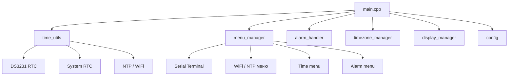

# Системная архитектура прошивки Nixie Clock для ESP32

## Цель документа
Этот файл фиксирует текущее состояние ядра прошивки и описывает:
- архитектуру управления временем и часовыми поясами
- взаимодействие ключевых модулей
- меню и командную систему
- обработку будильников и синхронизацию

Документ подготовлен как «мастер-описание» для последующей сборки в `.docx` с диаграммами, содержанием и списком функций.

## Структура документа
1. Общий обзор архитектуры
2. Система времени и выбор источника
3. Механизм часовых поясов
4. Система меню и команд
5. Система будильников
6. Основной цикл и интеграция
7. Ключевые файлы и функции
8. Точки расширения

---

## 1. Общий обзор архитектуры

Прошивка построена как набор модулей, объединённых общим ядром:
- `main.cpp` — точка входа, инициирует подсистемы и запускает цикл
- `src/time_utils.cpp` / `include/time_utils.h` — единая система времени
- `src/timezone_manager.cpp` / `include/timezone_manager.h` — управление часовыми поясами
- `src/menu/menu_manager.cpp` / `include/menu_manager.h` — меню и команды
- `src/alarm_handler.cpp` / `include/alarm_handler.h` — будильники
- `src/config.cpp` / `include/config.h` — хранилище параметров и структура конфигурации
- `src/platform_profile.cpp` — описание возможностей конкретной аппаратной платформы

### Блок-схема подсистем

### Цели архитектуры
- создать общее ядро, работающее на разных типах часов
- обеспечить устойчивый выбор источника времени
- предоставить командное меню для настройки всех критичных параметров
- поддержать офлайн и онлайн режимы часовых поясов
- обеспечить автономную работу при отсутствии внешнего RTC и WiFi

---

## 2. Система времени и выбор источника

### Источники времени
Система времени использует два основных источника:
- `DS3231` — внешний аппаратный RTC на I2C (приоритетный)
- встроенные часы ESP32 (`System RTC`) — резервный

### Основная логика выбора
Функция `checkTimeSource()` выполняет:
- инициализацию I2C-шины
- поиск устройства DS3231 по адресу `0x68`
- создание объекта `RTC_DS3231`
- проверку корректности времени
- переключение на `EXTERNAL_DS3231` или `INTERNAL_RTC`
- установку прерываний через `setupInterrupts()`

Приоритет источников:
1. DS3231, если доступен и время корректно
2. System RTC, если DS3231 отсутствует или выдаёт некорректное время

### Сценарии работы
- DS3231 доступен: используется внешний RTC и системное время синхронизируется с ним
- DS3231 отключён во время работы: система автоматически переключается на внутренний RTC
- DS3231 восстановлен: система переключается обратно на внешний источник
- DS3231 предоставляет некорректное время: используется System RTC

### Проверка времени DS3231
Проверка включает:
- чтение регистра статуса OSF - флага пропажи питания RTC (отсутвтие батарейки/слабюая батарейка)
- валидацию даты/времени (год 2025–2100, правильный день и месяц, корректные часы/минуты/секунды)
- при необходимости сброс флага OSF

### Ключевые функции
- `checkTimeSource()` — инициализация и поддержание источника времени
- `getCurrentUTCTime()` — единый интерфейс получения UTC
- `setTimeToAllSources(time_t utcTime)` — запись времени в System RTC и DS3231
- `setDefaultTimeToAllSources()` — установка базового времени при ошибке RTC

### Алгоритм получения времени
Вся система обращается к `getCurrentUTCTime()`:
- вызывает `checkTimeSource()` для актуализации источника
- если активен DS3231 — возвращает его время
- иначе — возвращает системное время ESP32

### Прерывания и тик
Время обновляется не только по опросу, но и через прерывания:
- если DS3231 активен — используется SQW pin (1 Hz), обработчик `onSQWInterrupt()` (`src/hardware.cpp`)
- если SQW «молчит» более 5 секунд или DS3231 отсутствует — система переходит на программный отсчёт по `millis()` (`processSecondTicksByMillis()` в `main.cpp`)

Обработчик `onSQWInterrupt()` только устанавливает флаг обновления (`timeUpdatedFromSQW`) и не выполняет тяжёлую логику.

---

## 3. Механизм часовых поясов

Подсистема часовых поясов оформлена отдельно в [technical/TIMEZONE_SYSTEM.md](technical/TIMEZONE_SYSTEM.md) и файлах:
- `src/timezone_manager.cpp`
- `include/timezone_manager.h`

Она отвечает за:
- выбор зоны по имени (`Europe/Warsaw`, `America/New_York` и т.д.)
- хранение текущего смещения `current_offset`
- вычисление DST и локального времени
- поддержку `automatic_localtime` и офлайн-режима по таблице
- сверку таблицы с ezTime при онлайн-синхронизации и автокоррекцию локального времени через сохранённый POSIX-оверрайд зоны (`tz_posix`), когда правила таблицы устарели

### Компоненты
- `findPresetByLocation()` — поиск пресета по зоне
- `calculateDSTStatus()` — вычисление активного DST
- `utcToLocal()` / `localToUtc()` — преобразования между UTC и локальным временем
- `setTimezone()` — установка зоны по имени

> Для подробностей по таблицам TZ, правилам DST и работе online/offline режимов используйте `TIMEZONE_SYSTEM.md`. Этот документ оставлен как отдельный технический справочник, потому что подсистема часовых поясов содержит подробные таблицы, правила и примеры.

---

## 4. Система меню и команд

Меню построено как иерархия состояний в `src/menu/menu_manager.cpp`.

### Основные состояния
- `MENU_MAIN`
- `MENU_TIME`
- `MENU_ALARMS`
- `MENU_WIFI`
- `MENU_DISPLAY`
- `MENU_INFO`
- `MENU_CONFIG`
- `MENU_ENGINEERING`

### Вход в режим меню
Функция `enterMenuMode()`:
- переводит устройство в режим настройки
- отключает регулярный вывод времени в Serial
- выводит главное меню с пунктами 1–6

Команда `o`, `out`, `exit` возвращает из меню.

### Главное меню
Выбор подменю:
1. Настройки времени и часовых поясов
2. Управление будильниками
3. Звук и дисплей
4. Настройки WI-FI и NTP
5. Информация о системе
6. Конфигурация

### Обработка команд
Функция `handleCommonMenuCommands()` обрабатывает общие команды:
- `menu`, `m`
- `back`, `b`
- `out`, `exit`, `o`
- `help`, `?`

Каждая подменю-функция сначала вызывает `handleCommonMenuCommands()`, чтобы сохранить единый интерфейс.

### Краткое описание меню и команд
Полная карта меню и команд доступна в [technical/MENU_COMMANDS_STRUCTURE.md](technical/MENU_COMMANDS_STRUCTURE.md).

Кратко:
- Главное меню управляется из `src/menu/menu_manager.cpp`.
- Общие команды (`menu`, `back`, `out`, `help`) обрабатывает `handleCommonMenuCommands()`.
- Подменю времени, будильников, дисплея, WiFi/NTP, информации, конфигурации и инженерного меню имеют свои экраны и обработчики.
- `src/menu/menu_wifi_ntp.cpp` реализует настройку WiFi и NTP.
- `src/menu/menu_sound_display.cpp` реализует настройки звука и дисплея.
- `src/menu/menu_info_config.cpp` реализует просмотр системной информации и управление конфигурацией.
- `src/engineering_menu.cpp` реализует инженерное меню с аппаратными настройками, тестами и сервисными счётчиками.

Механизм построен так, чтобы разделять отображение меню и обработку команд.

---

## 5. Система будильников

Будильники реализованы в `src/alarm_handler.cpp`.

### Структура данных
Определена в `include/config.h`:
- `AlarmSettings alarm1`
- `AlarmSettings alarm2`

Поля `AlarmSettings`:
- `hour`, `minute`
- `enabled`
- `melody`
- `days_mask` — для будильника 2
- `once` — для одноразового будильника 1

### Поведение
- `checkAlarms()` вызывается регулярно из основного цикла
- оно получает UTC через `getCurrentUTCTime()` и переводит в локальное время
- `checkAlarmsAtTick()` срабатывает только при `tm_sec == 0`

### Условия срабатывания
- будильник 1: фиксированное время, ежедневно или одноразово
- будильник 2: фиксированное время + маска дней недели

### Управляющие функции
- `setAlarm(alarmNum, timeStr)`
- `setAlarmMelody(alarmNum, melody)`
- `setAlarmOnceMode(alarmNum, once)`
- `setAlarmDaysMask(alarmNum, daysMask)`
- `disableAlarm(alarmNum)` / `enableAlarm(alarmNum)`
- `getMinutesToNextAlarm()` — вычисление времени до следующего события

### Действия при срабатывании
- логирование события в Serial
- включение аудио через `audioTaskStart()` и `audioPlayAlarmMelody()`
- отключение одноразового будильника после срабатывания

---

## 6. Основной цикл и интеграция

В `main.cpp` происходит:
- инициализация оборудования и конфигурации
- запуск подзадач дисплея и OTA
- регулярный опрос времени и состояния
- поддержка режима синхронизации и отображения

### Взаимодействие модулей
- `main.cpp` использует `getCurrentUTCTime()` для всех временных проверок
- `display_manager` получает локальное время из `utcToLocal()`
- `alarm_handler` использует локальное время для условий срабатывания
- `menu_manager` управляет настройками и вызывает time/zone функции
- `timezone_manager` вычисляет `current_offset` и DST

### Особенности
- `printEnabled` управляет выводом времени через Serial
- `syncTimeAsync()` создаёт фонную FreeRTOS-задачу на ядре 0
- `displayRefreshTask()` может использовать время для обновления анимаций
- время и меню сохраняются в конфигурации NVS

---

## 7. Ключевые файлы и функции

### Основные файлы
- `src/main.cpp`
- `src/time_utils.cpp`
- `src/timezone_manager.cpp`
- `src/menu/menu_manager.cpp`
- `src/alarm_handler.cpp`
- `src/config.cpp`
- `src/platform_profile.cpp`

### Важные функции
- `checkTimeSource()` — проверяет доступность источников времени, инициализирует DS3231 и I2C, обрабатывает переходы между внешним RTC и System RTC, а также поддерживает установку прерываний и обработку флага OSF.
- `getCurrentUTCTime()` — единый интерфейс для всех модулей: актуализирует источник времени и возвращает текущий UTC из DS3231 или системного RTC.
- `setTimeToAllSources()` — синхронизирует указанное UTC-время с системным RTC ESP32 и при наличии обновляет внешний DS3231.
- `syncTimeAsync()` — запускает фоновую FreeRTOS-задачу для NTP-синхронизации, проверяет условия запуска, WiFi и настройки автосинхронизации.
- `printTime()` — выводит текущее время в Serial, включая строку локального времени, зону, текущее смещение и статус DST.
- `enterMenuMode()` / `exitMenuMode()` — переводят устройство в режим настройки или выходят из него, управляют отображением меню, состоянием `printEnabled` и возвратом в главное меню.
- `handleMainMenu()` / `handleTimeMenu()` / `handleAlarmMenu()` — обрабатывают ввод пользователя для главного меню и подменю, переключают состояния, вызывают печать меню и запускают соответствующие действия.
- `checkAlarms()` / `checkAlarmsAtTick()` — проверяют условия срабатывания будильников, конвертируют UTC в локальное время, запускают аудио и отключают одноразовый будильник после срабатывания.
- `utcToLocal()` / `localToUtc()` — преобразуют время между UTC и локальным часовым поясом, используя текущие настройки TZ, таблицы DST и/или ezTime.

---

## 8. Точки расширения

### Расширяемость ядра
Проект рассчитан на использование общего ядра для разных типов часов и дисплеев:
- `platform_profile.cpp` содержит флаговую модель возможностей
- меню скрывает команды, если аппаратная функция не поддерживается
- `display_manager` работает независимо от вида дисплея

### Новые источники времени
В систему можно добавить новые источники, например:
- NTP как приоритетный источник
- радиочасы DCF77
- GPS

Для этого нужно:
- расширить `HardwareSource` в `include/hardware.h`
- добавить проверку наличия в `checkTimeSource()`
- дописать логику чтения в `getCurrentUTCTime()`

### Новые меню и команды
- новые подменю добавляются в `src/menu/menu_manager.cpp`
- команды обрабатываются через `handleCommonMenuCommands()` и специальную функцию подменю

---

## Рекомендуемая структура .docx
1. Введение
2. Архитектура системы — из [SYSTEM_ARCHITECTURE.md](SYSTEM_ARCHITECTURE.md)
3. Система времени — из [technical/TIME_MANAGER.md](technical/TIME_MANAGER.md)
   - Источники
   - Алгоритм выбора
   - Тайминги и прерывания
4. Часовые пояса — из [technical/TIMEZONE_SYSTEM.md](technical/TIMEZONE_SYSTEM.md)
5. Ядро платформы — из [technical/PLATFORM_CORE.md](technical/PLATFORM_CORE.md)
6. Меню и пользовательский интерфейс — из [technical/MENU_SYSTEM.md](technical/MENU_SYSTEM.md)
7. Справочник команд — из [technical/MENU_COMMANDS_STRUCTURE.md](technical/MENU_COMMANDS_STRUCTURE.md)
8. Инженерное меню — из [technical/ENGINEERING_MENU.md](technical/ENGINEERING_MENU.md)
9. Будильники — из [technical/ALARM_SYSTEM.md](technical/ALARM_SYSTEM.md)
10. Жизненный цикл прошивки
11. Файловая карта и исполнители функций
12. Сценарии отказа и восстановление
13. Планы расширения

---

## Источники
- [SYSTEM_ARCHITECTURE.md](SYSTEM_ARCHITECTURE.md) — текущее описание архитектуры
- [technical/TIME_MANAGER.md](technical/TIME_MANAGER.md) — подробное описание подсистемы времени
- [technical/TIMEZONE_SYSTEM.md](technical/TIMEZONE_SYSTEM.md) — подробное описание системы часовых поясов
- [technical/MENU_SYSTEM.md](technical/MENU_SYSTEM.md) — описание меню и команд
- [technical/MENU_COMMANDS_STRUCTURE.md](technical/MENU_COMMANDS_STRUCTURE.md) — человекочитаемое дерево меню и команд
- [technical/ENGINEERING_MENU.md](technical/ENGINEERING_MENU.md) — описание инженерного меню
- [technical/ALARM_SYSTEM.md](technical/ALARM_SYSTEM.md) — описание будильников
- [technical/PLATFORM_CORE.md](technical/PLATFORM_CORE.md) — описание ядра платформы
