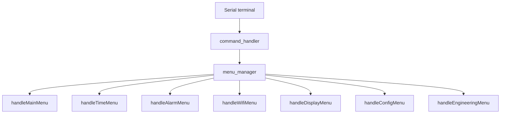

# Система меню и команд прошивки Nixie Clock

## Назначение
Документ описывает архитектуру текстового меню и управления командной строкой проекта.

См. также подробную карту меню и систему команд в [MENU_COMMANDS_STRUCTURE.md](MENU_COMMANDS_STRUCTURE.md).

## Компоненты
- `include/menu_manager.h`
- `src/menu/menu_manager.cpp`
- `src/menu/menu_wifi_ntp.cpp`
- `src/menu/menu_sound_display.cpp`
- `src/menu/menu_info_config.cpp`
- `src/command_handler.cpp`

## Модель состояния меню

Меню имеет иерархическую модель состояний:
- MENU_MAIN
- MENU_TIME
- MENU_ALARMS
- MENU_WIFI
- MENU_DISPLAY
- MENU_INFO
- MENU_CONFIG
- MENU_ENGINEERING

Переключение между состояниями осуществляется через `currentMenuState`.

## Вход/выход из меню

### enterMenuMode()
- включает `inMenuMode`
- отключает печать времени в Serial (`printEnabled = false`)
- выводит главное меню
- даёт инструкции по выходу (`o`, `out`, `exit`)

### exitMenuMode()
- выключает `inMenuMode`
- восстанавливает авто-печать времени
- возвращает состояние в `MENU_MAIN`

## Главное меню

Команда выбора подменю:
- 1 — Время и часовые пояса
- 2 — Будильники
- 3 — Звук и дисплей
- 4 — WI-FI и NTP
- 5 — Информация о системе
- 6 — Конфигурация

В меню работает и команда `help` / `?` для повторного вывода текущего экрана.

## Общие команды

Функция `handleCommonMenuCommands(const String &command, void (*printMenu)())` обрабатывает:
- `menu`, `m` — переход в главное меню
- `back`, `b` — возврат на уровень выше
- `out`, `exit`, `o` — выход из меню
- `help`, `?` — повторный вывод текущего меню

Этот механизм обеспечивает единый интерфейс и позволяет
избавиться от дублирования в отдельных обработчиках подменю.

## Подменю и команды

### Меню времени
Выводит текущую конфигурацию часового пояса и поддерживает команды:
- `time` / `t`
- `sync`
- `set UTC T HH:MM:SS`
- `set UTC D DD.MM.YY`
- `set local T HH:MM:SS`
- `set local D DD.MM.YY`
- `auto sync en` / `ase`
- `auto sync dis` / `asd`
- `tz list` / `tzl`
- `tz auto` / `tza`
- `tz manual` / `tzm`
- `tz check` / `tzc`

### Меню будильников
Поддерживает команды для настройки будильников:
- установка времени будильника
- выбор мелодии
- режим одноразового будильника
- маска дней недели
- включение/отключение будильников

### Меню Wi-Fi / NTP
Включает команды для:
- настройки WiFi
- выбора NTP серверов
- запуска синхронизации
- управления автосинхронизацией

### Меню дисплея и звука
Содержит команды для:
- настройки яркости
- управления звуковыми параметрами
- вывода состояния дисплея

### Меню информации и конфигурации
Показывает системные данные и позволяет управлять конфигурацией устройства.

## Принципы реализации

- Меню разделено на два слоя: вывод (`print*Menu`) и обработка (`handle*Menu`).
- Каждый `handle*Menu` сначала проверяет общие команды.
- Специальный `printMappingMenuCommands()` добавляет стандартный набор навигационных команд.
- Некоторые команды доступны только при поддержке платформы: проверяется `platformGetCapabilities()`.

## Рекомендуемая схема

## Что важно задокументировать агенту

- дерево меню и набор команд
- правила навигации (`help`, `back`, `out`)
- ветвления в `handleTimeMenu()` и `handleAlarmMenu()`
- зависимость доступных пунктов от аппаратных возможностей

---

## Связанные файлы
- `include/menu_manager.h`
- `src/menu/menu_manager.cpp`
- `src/command_handler.cpp`
- `src/menu/menu_wifi_ntp.cpp`
- `src/menu/menu_sound_display.cpp`
- `src/menu/menu_info_config.cpp`
